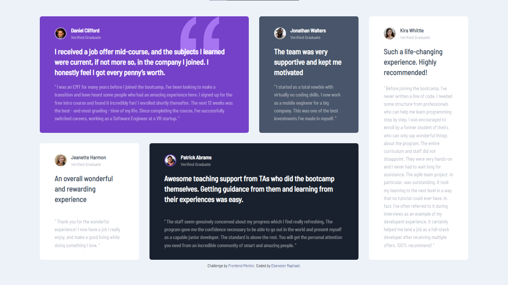

# Frontend Mentor - Testimonials grid section solution

This is a solution to the [Testimonials grid section challenge on Frontend Mentor](https://www.frontendmentor.io/challenges/testimonials-grid-section-Nnw6J7Un7). Frontend Mentor challenges help you improve your coding skills by building realistic projects. 

## Table of contents

- [Overview](#overview)
  - [The challenge](#the-challenge)
  - [Screenshot](#screenshot)
  - [Links](#links)
- [My process](#my-process)
  - [Built with](#built-with)
  - [What I learned](#what-i-learned)
  - [Continued development](#continued-development)
  - [Useful resources](#useful-resources)
- [Author](#author)

## Overview

### The challenge

Users should be able to:

- View the optimal layout for the site depending on their device's screen size

### Screenshot

### Links

- Solution URL: [GitHub](https://github.com/ebenezerraph/testimonials-grid-section-main)
- Live Site URL: [Testimonials Grid Section](https://ebenezerraph.github.io/testimonials-grid-section-main/)

## My process

### Built with

- Semantic HTML5 markup
- Flexbox
- CSS Grid
- Mobile-first workflow
- [TailwindCSS](https://tailwindcss.com/) - CSS framework

### What I learned

I used to this challenge to practice and hone my newly gotten TailwindCSS skills.

### Continued development

I look forward to practicing and using TailwindCSS in my projects and solutions more often, to keep improving and growing my skills.

### Useful resources

- [Official TailwindCSS Documentation](https://tailwindcss.com/docs/) - This is my go-to TailwindCSS resource, as it has a ton of helpful and well structured tutorials on each of the basic TailwindCSS concepts. I'd highly recommend it, any time, any where.
- [nekoCalc](https://nekocalc.com/px-to-rem-converter) - nekoClac's PX to REM converter helped me convert the `px` length unit to `rem`, for easier customization and a pixel-perfect design.

## Author

- Website - [Ebenezer Raphael](https://ebenezerraph.wordpress.com)
- Frontend Mentor - [@ebenezerraph](https://www.frontendmentor.io/profile/ebenezerraph)
- X - [@ebenezerraph](https://www.x.com/ebenezerraph)
